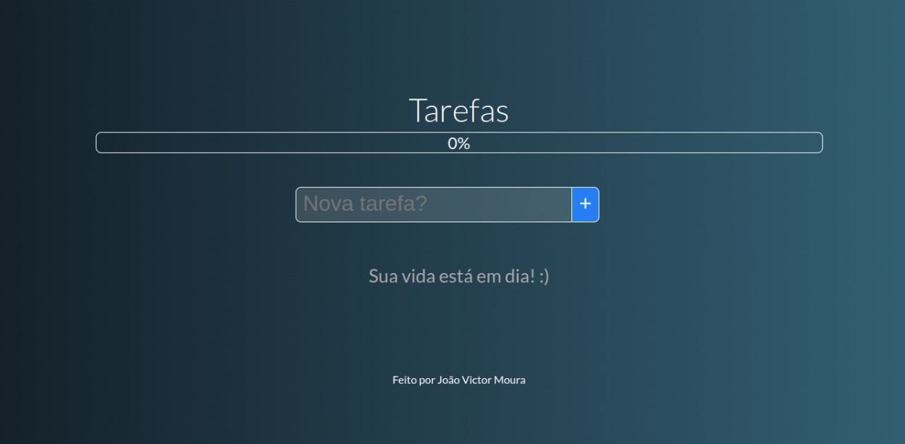
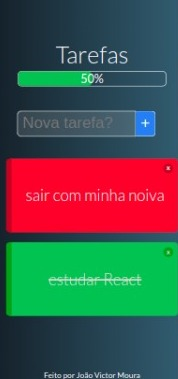

# Lista de a fazeres 📝

Trata-se de uma lista de a fazeres feita com Vue.js.

# A aplicação está on-line no link: 

```
https://to-do-vue-delta.vercel.app/
```

## Caso você queira analisar o projeto em sua maquina, siga este passo a passo: 😁

<br>

### Clone o repositório😎

```
git clone https://github.com/jovimoura/toDo-vue
```

### Acesse o diretorio🤓

```
cd <nome-da-pasta>
```
### Instale as dependências🤠
```
npm install
```
### Inicie a aplicação🤩
```
npm run serve
```
### A aplicação, por padrão, fica na porta:🤗

```
http://localhost:8080/
```

## Imagem do projeto 💻



## Imagem do design responsivo 📱



## Tecnologias utilizadas🦉

<ul>
    <li>Vue.js</li>
    <li>JavaScript</li>
</ul>

## Autor😃

### João Victor dos Santos Moura
### E-mail: joaovictors.mouraa@gmail.com
### Linkedin: https://www.linkedin.com/in/jovimoura10/